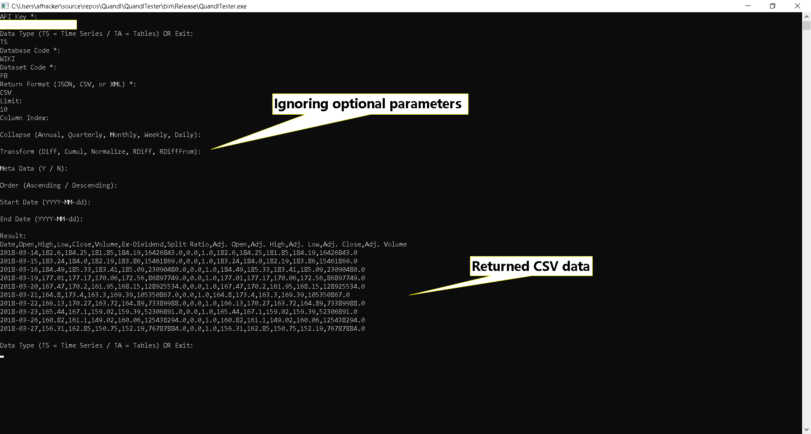

# QuandlTester
The tester app allows you to test the Quandl library in the console.

## Quick Start
When you run the tester app the first thing it asks is your Quandl API key:

```bash
API Key *:
```

Enter your API key and press enter.

Then it will ask for the type of data you want to get from Quandl:

```bash
Data Type (TS = Time Series / TA = Tables) OR Exit:
```

Enter "TS" for getting time series data or TA for getting tables data.

Then follow each step for getting the data, in the last step the tester app will display the returned data from Quandl in plain text:

